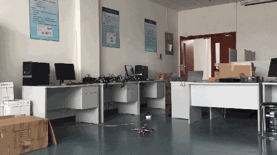
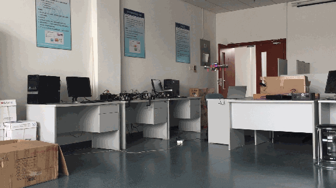

# DroneController
Scripts to control the ArduCopter drone indoors via MAVLink protocol.

# Demo

The drone can be commanded to automatically takeoff

Control its movement in air

And land

All these actions are done without any command from a RC transmitter. The drone is fully controlled by an onboard Raspberry Pi.

## GUIDED

**This is the main method applied for our applications.**

Libraries and examples used to control the drone's movements in GUIDED mode, if the drone is implemented with an optical flow sensor and a rangefinder.

Velocity control, position control and yaw control are currently avaliable by``import FlightController`` , and several example scripts are provided to control the vehicle with SITL, or a real drone.

## GUIDED_NOGPS

Take off, and control the drone's movement in GUIDED_NOGPS mode.

**Special Thanks** to [Missouri S&T Multi-Rotor Robot Design Team](https://github.com/MST-MRR) and [Mark Raymond Jr](https://github.com/markrjr). Controlling methods in GUIDED_NOGPS are based on their valuable work.

